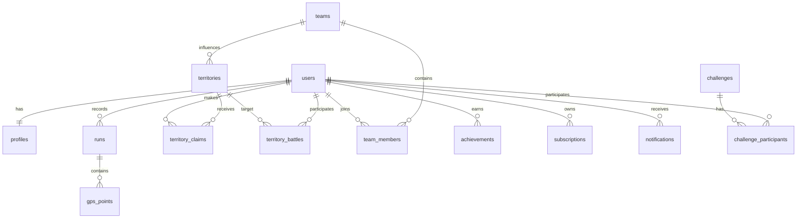

# TerraRun Product & Technical Specification

Version: 1.0  
Product: TerraRun  
Territory System: Grid-based real-world territory claiming  
Scale Target: MVP/startup, under 10K users, with upgrade path to city-scale and regional-scale growth  
Business Model: Freemium subscription  
Core Concept: TerraRun is a fitness app where users claim real-world territory by running in actual locations, turning workouts into a competitive game. Every run expands a user's territory, while other runners can challenge, battle, or take over areas through activity and performance. It combines GPS fitness tracking, social competition, and gamified map ownership to make running addictive and community-driven.

---

## 1. Executive Overview

### 1.1 Vision

TerraRun turns running into a real-world strategy game. Instead of tracking distance only, users build a visible territory footprint on the map, defend it through continued activity, and compete with individuals, teams, and local communities.

### 1.2 Mission

Make outdoor running more motivating, social, and habit-forming by connecting fitness progress to map ownership, competition, team play, and real-world identity.

### 1.3 Problem Statement

Most running apps optimize for metrics: pace, distance, streaks, routes, and personal records. These are useful, but they can become repetitive for casual runners. Many users need stronger motivation, social context, and visible progression.

TerraRun solves this by transforming real movement into a persistent game layer over the real world.

### 1.4 Unique Selling Proposition

Users do not only complete runs. They conquer, defend, and expand a personal or team territory map based on verified GPS activity.

### 1.5 Market Opportunity

TerraRun sits at the intersection of:

- Fitness tracking apps such as Strava, Nike Run Club, Runkeeper, and Adidas Running
- Location-based games such as Pokemon Go and Ingress
- Social competition platforms and community fitness challenges
- Subscription wellness products

The opportunity is to serve runners who want more than passive tracking, especially casual runners, competitive local athletes, running clubs, and urban communities.

### 1.6 Product Positioning

TerraRun should position itself as:

- A running app first: accurate tracking, route history, pace, distance, and stats must work reliably.
- A territory game second: grid ownership, battles, factions, leaderboards, and achievements create retention.
- A community platform third: teams, local rivalries, challenges, and city leaderboards create growth loops.

### 1.7 Competitive Landscape

| Product | Strength | Gap TerraRun Exploits |
|---|---|---|
| Strava | Fitness community, segments, leaderboards | Less persistent map ownership and game strategy |
| Nike Run Club | Guided runs, brand trust | Limited competitive territory mechanics |
| Runkeeper | Simple tracking | Lower social and game depth |
| Pokemon Go | Location-based engagement | Not fitness-first or runner-focused |
| Ingress | Territory game mechanics | Not fitness/wellness positioned |
| Komoot | Route planning | Not competitive or territory-based |

---

## 2. Product Overview

### 2.1 Product Goals

- Increase running motivation through persistent territory progression.
- Create local competition through individual and team ownership.
- Support verified outdoor runs with anti-cheat protections.
- Build a freemium funnel through premium analytics, advanced challenges, and team features.
- Launch an MVP that can operate under 10K users while leaving a clear path to larger scale.

### 2.2 Target Users

#### Casual Runner

Wants motivation, progress, simple tracking, and game-like rewards.

#### Competitive Runner

Wants leaderboards, route dominance, territory battles, and performance-based challenges.

#### Social Runner

Wants teams, friends, local clubs, group challenges, and shared goals.

#### Explorer

Wants to discover new streets, parks, neighborhoods, and city areas.

#### Team Captain

Creates factions, recruits members, coordinates battles, and tracks team territory.

### 2.3 Primary User Flow

1. User signs up.
2. User grants location and motion permissions.
3. User starts a run.
4. App records GPS points in the background.
5. User ends the run.
6. Backend validates GPS quality and movement.
7. GPS path maps to grid cells.
8. Eligible cells are claimed, reinforced, or contested.
9. User sees updated territory, stats, achievements, and leaderboard movement.

### 2.4 MVP Scope

MVP must include:

- Authentication
- User profile
- Run start/end tracking
- GPS point upload
- Grid territory map
- Solo territory claiming
- Basic leaderboards
- Basic achievements
- Subscription gating hooks
- Admin tools for moderation and fraud review

MVP should exclude or keep lightweight:

- Complex battle simulations
- Full clan war seasons
- AI coach
- Advanced route recommendations
- Large-scale event engine

---

## 3. Full PRD

### 3.1 Goals & KPIs

| Goal | KPI | MVP Target |
|---|---|---|
| Drive activation | First run completed | 45% of signups |
| Build habit | Weekly active runners | 30% of registered users |
| Validate territory loop | Users claiming 10+ cells | 25% of active runners |
| Encourage competition | Leaderboard views per active user | 3+ per week |
| Validate monetization | Free-to-paid conversion | 3% to 7% |
| Reduce fraud | Suspicious runs flagged | Under 5% false positive rate after review |
| Retain users | 30-day retention | 20%+ MVP target |

### 3.2 User Personas

| Persona | Motivation | Needs | Risks |
|---|---|---|---|
| Maya, casual runner | Stay consistent | Simple tracking, visible progress | Too much competition may intimidate |
| Alex, competitive runner | Win local rankings | Accurate stats, battles, leaderboards | Will churn if anti-cheat is weak |
| Priya, team captain | Build a local crew | Team tools, territory view, invites | Needs social features early |
| Jordan, explorer | Discover areas | Map coverage, achievements | Needs novelty and good map UX |

### 3.3 Use Cases

- Track an outdoor run.
- Claim unowned grid cells.
- Reinforce owned grid cells.
- Challenge another user's cell.
- Join or create a team.
- View personal and team territory.
- Compete on global, city, team, and friend leaderboards.
- Unlock achievements for distance, streaks, exploration, and conquest.
- Subscribe to premium for advanced analytics and enhanced competitive tools.

### 3.4 Feature Prioritization

#### P0: MVP Required

- Clerk authentication
- User profile creation
- Run session lifecycle
- GPS capture and upload
- Post-run GPS validation
- Grid cell generation
- Territory claim processing
- Map display with owned cells
- Basic leaderboards
- Basic fraud flags
- Subscription model scaffolding

#### P1: Beta

- Battles/challenges
- Teams/factions
- Team territory map
- Notifications
- Achievement system
- Streaks
- City leaderboards
- Admin review panel

#### P2: Growth

- Seasons
- Clan wars
- Premium analytics
- Advanced anti-cheat
- Social feed
- Route recommendations
- Event campaigns

#### P3: Expansion

- AI coaching
- Brand partnerships
- Sponsored city challenges
- Wearable integrations
- Public API

### 3.5 Product Roadmap

#### Phase 1: MVP

Duration: 8 to 12 weeks

- Auth
- Profile
- GPS run tracking
- Territory grid
- Solo claiming
- Basic map
- Basic leaderboard
- Admin fraud review

#### Phase 2: Beta

Duration: 8 to 10 weeks

- Battles
- Challenges
- Teams
- Notifications
- Achievements
- Subscription checkout

#### Phase 3: Production

Duration: 12+ weeks

- Premium analytics
- Team seasons
- Better anti-cheat
- City launch tooling
- Monitoring and scaling
- App Store and Play Store release hardening

### 3.6 Success Metrics

- Runs per active user per week
- Claimed cells per active user
- Retention by claimed-cell cohort
- Battle participation rate
- Team join rate
- Fraud flag rate
- Subscription conversion
- Subscription retention
- Map render latency
- Run processing latency

---

## 4. Full SRS

### 4.1 Functional Requirements

#### Authentication

- Users must sign up using email, Apple, Google, or supported Clerk social login.
- Users must have a unique internal user ID mapped to Clerk subject ID.
- Backend APIs must validate Clerk JWTs.
- Users must be able to delete or deactivate accounts.

#### Profile

- Users must create a display name.
- Users may upload an avatar.
- Users may set a home city.
- Users may choose privacy settings.

#### Run Tracking

- Users must be able to start, pause, resume, and end runs.
- Mobile app must record GPS points during active runs.
- App must record timestamp, latitude, longitude, altitude, speed, heading, horizontal accuracy, and battery state where available.
- App must continue tracking in background when OS permissions allow.
- Runs must be uploaded in batches during active tracking and finalized on run end.

#### Territory Claiming

- The backend must convert GPS paths to grid cells.
- Cells must be claimable only when validation passes.
- Unowned cells become owned by the runner.
- Owned cells can be reinforced by the owner.
- Enemy cells can become contested or challenged depending on game rules.

#### Battles & Challenges

- Users must be able to challenge eligible territories.
- Battle eligibility depends on cooldown, ownership strength, user limits, and fraud score.
- Battles must resolve through measurable performance: distance, pace consistency, elevation-adjusted effort, or repeat activity.

#### Teams/Factions

- Users must create, join, leave, and manage teams.
- Teams must have owners/admins.
- Team territory score must aggregate member-owned cells or team-claimed cells depending on selected rule set.

#### Leaderboards

- Leaderboards must support global, city, friends, and team rankings.
- Leaderboards must rank by territory count, weekly distance, battles won, streak, and exploration score.

#### Subscriptions

- Users may subscribe to premium.
- Premium gates should include advanced analytics, extra challenge slots, advanced map filters, historical territory playback, and team tools.
- Core run tracking and basic territory claiming remain free.

### 4.2 Non-Functional Requirements

| Category | Requirement |
|---|---|
| Availability | 99.5% MVP target |
| API latency | P95 under 500ms for common reads |
| Run processing | P95 under 30 seconds for standard runs |
| Map reads | P95 under 800ms for visible territory viewport |
| Data durability | Daily backups, point-in-time recovery preferred |
| Privacy | Users control public visibility |
| Security | JWT validation, rate limits, audit logs |
| Scalability | Support under 10K users initially, scalable by service extraction and spatial indexing |

### 4.3 Business Rules

- A user can have only one active run at a time.
- A run must have minimum duration and distance to claim territory.
- GPS points with poor accuracy may be ignored.
- Vehicle-like speeds invalidate or partially invalidate runs.
- Claimed cells receive strength points.
- Territory strength decays over time if not reinforced.
- A user cannot repeatedly farm the same cell beyond daily reinforcement caps.
- Team ownership cannot override personal ownership unless using explicit team battle mode.
- Premium features must not create unfair core fitness advantages.

### 4.4 GPS & Location Requirements

- Minimum run distance for claiming: 500 meters.
- Minimum valid duration: 5 minutes.
- Recommended GPS accuracy threshold: <= 30 meters.
- Points worse than 50 meters accuracy should not count for claiming.
- Maximum plausible running speed: 8 m/s by default, with tolerance for short bursts.
- Minimum point interval: 1 to 5 seconds during active tracking.
- Batch upload interval: 10 to 30 seconds.
- Backend must reject runs with impossible jumps, teleportation, or repeated identical points.

### 4.5 Security Requirements

- All APIs require HTTPS.
- Authenticated APIs require Clerk JWT.
- Sensitive mutations require user ID from verified token, never request body.
- Rate limits per user, IP, and device.
- Audit logs for battles, claims, subscription changes, and admin actions.
- PII minimized and encrypted where appropriate.
- Location data access must respect privacy settings.

### 4.6 Scalability Constraints

MVP can use a modular monolith NestJS backend with clear module boundaries. Upgrade path should allow extraction of:

- GPS processing service
- Territory service
- Battle service
- Leaderboard service
- Notification service

PostgreSQL + PostGIS can support MVP and early growth if indexed correctly. Redis should be added for caching map tiles, leaderboards, rate limits, and job queues.

### 4.7 Edge Cases

- User loses network during run.
- User force-closes app.
- GPS permission revoked mid-run.
- Run crosses water, private property, or restricted areas.
- Two users claim the same unowned cell at nearly the same time.
- A user starts a run on multiple devices.
- GPS points arrive out of order.
- User changes team during pending battle.
- Subscription expires during premium challenge.
- User deletes account with territory history.

### 4.8 Error Handling

| Scenario | Expected Behavior |
|---|---|
| Invalid token | Return 401 |
| Missing permission | Mobile app shows permission recovery state |
| Active run already exists | Return 409 with active run ID |
| Low GPS quality | Save run but skip claims or mark as low confidence |
| Claim conflict | Resolve transactionally using row locks or serializable transaction |
| Rate limit exceeded | Return 429 with retry metadata |
| Map query too large | Return 400 and ask client to zoom in |

### 4.9 Acceptance Criteria

- A user can sign up, start a run, upload GPS points, end the run, and see claimed territory.
- Invalid GPS activity does not claim territory.
- Territory map loads cells for a bounded viewport.
- Concurrent claims resolve deterministically.
- Leaderboard updates after a valid run.
- Backend APIs are protected by JWT auth.
- MVP can be deployed to staging and production with CI/CD.

---

## 5. System Architecture

### 5.1 Architecture Strategy

Use a modular monorepo with separate apps for web, mobile, admin, and backend. For MVP, keep backend modules inside one NestJS service to reduce operational complexity. Design module boundaries so they can later become services.

### 5.2 Monorepo Folder Structure

```text
terrarun/
├── apps/
│   ├── web/
│   │   ├── app/
│   │   ├── components/
│   │   ├── features/
│   │   └── lib/
│   ├── mobile/
│   │   ├── app/
│   │   ├── src/
│   │   ├── components/
│   │   └── modules/
│   └── admin/
│       ├── app/
│       └── features/
├── services/
│   └── api/
│       ├── src/
│       │   ├── auth/
│       │   ├── users/
│       │   ├── runs/
│       │   ├── gps/
│       │   ├── territories/
│       │   ├── battles/
│       │   ├── teams/
│       │   ├── leaderboards/
│       │   ├── subscriptions/
│       │   ├── notifications/
│       │   └── admin/
│       └── prisma/
├── packages/
│   ├── ui/
│   ├── shared-types/
│   ├── config/
│   ├── utils/
│   └── eslint-config/
├── infra/
│   ├── docker/
│   ├── github-actions/
│   └── terraform/
└── docs/
```

### 5.3 Website Architecture

Technology: Next.js

Responsibilities:

- Landing page
- Authenticated dashboard
- Profile and stats
- Territory map viewer
- Leaderboards
- Team pages
- Subscription management
- Admin redirect or lightweight admin shell

Key libraries:

- Next.js App Router
- Clerk Next.js SDK
- TanStack Query
- Zustand for local UI state
- Mapbox GL JS
- Tailwind CSS or design system package

### 5.4 Mobile Architecture

Technology: React Native + Expo

Responsibilities:

- Primary run tracking
- Background GPS recording
- Live route display
- Territory map
- Push notifications
- Profile and team interactions

Key libraries:

- Expo Location
- Expo Task Manager
- Expo Notifications
- React Query
- Zustand
- Mapbox React Native SDK or react-native-maps for MVP
- Clerk Expo SDK

### 5.5 Backend Architecture

Technology: NestJS

Core modules:

- Auth module: Clerk JWT validation and RBAC
- User module: profiles and preferences
- Run module: run lifecycle
- GPS module: point ingestion and validation
- Territory module: grid generation, claim resolution, map queries
- Battle module: challenge lifecycle
- Team module: factions and membership
- Leaderboard module: ranking jobs and reads
- Subscription module: Stripe or RevenueCat integration
- Notification module: push and email orchestration
- Admin module: moderation and fraud review

### 5.6 API Gateway

For MVP, NestJS acts as the API gateway. Later, an edge gateway or managed API gateway can handle:

- Request routing
- Authentication enforcement
- Rate limiting
- WAF rules
- API analytics

### 5.7 Service Communication

MVP:

- In-process NestJS module calls
- PostgreSQL transactions
- Redis-backed queues for async processing

Scale path:

- Internal HTTP or gRPC between services
- Event bus for run processed, territory claimed, battle resolved, subscription changed
- Dedicated workers for GPS and leaderboard processing

### 5.8 Real-Time Systems

MVP:

- Polling for map and leaderboard refresh
- Push notifications for battle and challenge events

Beta:

- WebSocket gateway for live battles and team updates
- Redis pub/sub or managed realtime provider

### 5.9 Notifications

Channels:

- Push notifications through Firebase Cloud Messaging
- Email through transactional email provider
- In-app notifications stored in PostgreSQL

Notification types:

- Territory claimed
- Territory lost
- Battle challenge received
- Battle resolved
- Team invite
- Achievement unlocked
- Subscription event

---

## 6. Technical Stack

| Layer | MVP Choice | Reason |
|---|---|---|
| Web | Next.js | Fast product development, Vercel support |
| Mobile | React Native + Expo | Cross-platform speed, background location support |
| Backend | NestJS | Strong module architecture, TypeScript end to end |
| Database | PostgreSQL + PostGIS | Geospatial queries and relational integrity |
| ORM | Prisma | Type-safe database access |
| Maps | Mapbox | Strong map rendering and custom layers |
| Auth | Clerk | Fast auth implementation and JWT integration |
| Storage | AWS S3 | Avatars, exports, future media |
| Notifications | Firebase Cloud Messaging | Mobile push support |
| Analytics | PostHog | Product analytics and event funnels |
| Payments | Stripe or RevenueCat | Stripe for web, RevenueCat useful for mobile subscriptions |
| Cache/Queues | Redis + BullMQ | Jobs, leaderboards, rate limits |
| Hosting | Vercel + Railway/AWS | Simple MVP deployment with upgrade path |
| Monitoring | Sentry + OpenTelemetry | Error tracking and tracing |

---

## 7. TerraRun Territory Engine

### 7.1 Territory Model

TerraRun divides the world into grid cells. Runs produce GPS paths. Valid path segments intersect cells. Cells become claimed, reinforced, contested, or captured based on ownership rules.

### 7.2 Hex vs Square Grid Analysis

| Criteria | Hex Grid | Square Grid |
|---|---|---|
| Visual game feel | Strong | Moderate |
| Neighbor consistency | 6 equal neighbors | 4 or 8 neighbors |
| Implementation complexity | Higher | Lower |
| Database simplicity | Moderate | Strong |
| Map tile alignment | Moderate | Strong |
| Strategic movement | Strong | Good |
| MVP speed | Moderate | Strong |

Recommendation:

- Use square grid for MVP because it is simpler, faster, and easier to query with bounding boxes.
- Keep cell abstraction generic so hex cells can be introduced later.
- Recommended MVP cell size: 100m x 100m in urban areas, with optional larger cells in low-density areas later.

### 7.3 Grid System Design

Use a deterministic grid index:

- Convert latitude/longitude to Web Mercator meters or a geohash-like indexing system.
- Snap coordinates to fixed-size cells.
- Store cell ID as `grid_version:x:y`.
- Store geometry as PostGIS polygon for spatial queries.

Example cell ID:

```text
v1:78542:49201
```

### 7.4 Claim Algorithm

1. Receive completed run.
2. Validate run duration, distance, speed, GPS accuracy, and point continuity.
3. Convert GPS points into a cleaned line string.
4. Segment line by distance and accuracy.
5. Intersect valid line with grid cells.
6. Calculate coverage score per cell.
7. Exclude cells below threshold.
8. For each eligible cell:
   - If unowned: claim for runner.
   - If owned by runner: reinforce.
   - If owned by team member: optionally reinforce team score.
   - If owned by opponent: mark contested or create challenge opportunity.
9. Persist claims in a transaction.
10. Queue leaderboard and notification updates.

### 7.5 Claim Eligibility

A cell is eligible if:

- Run is valid.
- User traversed at least 30m inside or through the cell.
- GPS accuracy for relevant points is acceptable.
- User has not exceeded daily cell claim or reinforcement caps.
- Cell is not under cooldown or protected state.

### 7.6 Ownership Rules

Cell states:

- `unowned`
- `owned`
- `contested`
- `cooldown`
- `protected`

Ownership properties:

- Owner user ID
- Owner team ID, nullable
- Strength score
- Last claimed at
- Last reinforced at
- Decay state
- Conflict status

### 7.7 Battle Rules

Battle types:

- Direct challenge: user challenges a specific cell.
- Route challenge: user challenges a cluster of cells by completing a route.
- Team battle: team members contribute to capture a zone.

Basic MVP battle resolution:

- Challenger must run through the target cell or zone.
- Defender can respond within a time window.
- Score is based on distance, pace consistency, and valid coverage.
- Winner gains or preserves territory strength.

Recommended beta formula:

```text
battle_score =
  valid_distance_m * 0.45 +
  pace_consistency_score * 0.25 +
  territory_coverage_score * 0.20 +
  streak_bonus * 0.10
```

### 7.8 Conflict Resolution

Concurrent claims must be resolved inside database transactions.

Rules:

- Earlier valid run end time wins unowned-cell race if processed close together.
- If timestamps are within a conflict window, higher coverage score wins.
- If tied, current owner retains cell.
- Use row-level locking on territory records.

### 7.9 Cooldown Logic

- New claims receive a short protection window, such as 6 hours.
- Captured cells receive battle cooldown, such as 24 hours.
- Repeated challenges by same user against same cell are limited.
- Premium users may receive more challenge slots but not shorter cooldowns if it harms fairness.

### 7.10 Territory Decay

Purpose: keep the map active and prevent permanent stale ownership.

Suggested model:

- Each cell has `strength_score`, range 0 to 100.
- Claim sets strength to 50.
- Reinforcement adds up to daily cap.
- Decay starts after 7 inactive days.
- Decay reduces 5 points per day.
- At 0 strength, cell becomes abandoned or easier to capture.

### 7.11 Anti-Cheat Design

Signals:

- Impossible speed
- Large GPS jumps
- Low GPS accuracy
- Emulator or rooted device signal where available
- Repeated synthetic-looking point intervals
- Straight-line movement inconsistent with roads/paths
- Duplicate routes at impossible consistency
- Background location anomalies
- Device/account switching patterns

Actions:

- Allow run but block claiming
- Mark run for review
- Reduce claim confidence
- Shadow limit suspicious account
- Suspend account after review

---

## 8. Database Design

### 8.1 Core Entities



### 8.2 Tables

#### users

```sql
CREATE TABLE users (
  id UUID PRIMARY KEY DEFAULT gen_random_uuid(),
  clerk_user_id TEXT UNIQUE NOT NULL,
  email TEXT UNIQUE NOT NULL,
  role TEXT NOT NULL DEFAULT 'user',
  status TEXT NOT NULL DEFAULT 'active',
  created_at TIMESTAMPTZ NOT NULL DEFAULT now(),
  updated_at TIMESTAMPTZ NOT NULL DEFAULT now()
);
```

Indexes:

- `users_clerk_user_id_idx`
- `users_email_idx`

#### profiles

```sql
CREATE TABLE profiles (
  user_id UUID PRIMARY KEY REFERENCES users(id) ON DELETE CASCADE,
  display_name TEXT NOT NULL,
  avatar_url TEXT,
  home_city TEXT,
  country_code TEXT,
  privacy_level TEXT NOT NULL DEFAULT 'public',
  created_at TIMESTAMPTZ NOT NULL DEFAULT now(),
  updated_at TIMESTAMPTZ NOT NULL DEFAULT now()
);
```

#### runs

```sql
CREATE TABLE runs (
  id UUID PRIMARY KEY DEFAULT gen_random_uuid(),
  user_id UUID NOT NULL REFERENCES users(id),
  status TEXT NOT NULL,
  started_at TIMESTAMPTZ NOT NULL,
  ended_at TIMESTAMPTZ,
  distance_m NUMERIC(10,2) DEFAULT 0,
  duration_s INTEGER DEFAULT 0,
  avg_pace_s_per_km INTEGER,
  max_speed_mps NUMERIC(6,2),
  fraud_score NUMERIC(5,2) DEFAULT 0,
  validation_status TEXT NOT NULL DEFAULT 'pending',
  route_geom GEOGRAPHY(LINESTRING, 4326),
  created_at TIMESTAMPTZ NOT NULL DEFAULT now(),
  updated_at TIMESTAMPTZ NOT NULL DEFAULT now()
);
```

Indexes:

- `runs_user_started_idx ON runs(user_id, started_at DESC)`
- `runs_status_idx ON runs(status)`
- `runs_route_gix ON runs USING GIST(route_geom)`

#### gps_points

```sql
CREATE TABLE gps_points (
  id BIGSERIAL PRIMARY KEY,
  run_id UUID NOT NULL REFERENCES runs(id) ON DELETE CASCADE,
  recorded_at TIMESTAMPTZ NOT NULL,
  latitude DOUBLE PRECISION NOT NULL,
  longitude DOUBLE PRECISION NOT NULL,
  altitude_m NUMERIC(8,2),
  speed_mps NUMERIC(6,2),
  heading NUMERIC(6,2),
  horizontal_accuracy_m NUMERIC(8,2),
  point GEOGRAPHY(POINT, 4326) GENERATED ALWAYS AS (
    ST_SetSRID(ST_MakePoint(longitude, latitude), 4326)::geography
  ) STORED
);
```

Indexes:

- `gps_points_run_time_idx ON gps_points(run_id, recorded_at)`
- `gps_points_point_gix ON gps_points USING GIST(point)`

#### territories

```sql
CREATE TABLE territories (
  id UUID PRIMARY KEY DEFAULT gen_random_uuid(),
  grid_version TEXT NOT NULL DEFAULT 'v1',
  cell_x INTEGER NOT NULL,
  cell_y INTEGER NOT NULL,
  cell_id TEXT UNIQUE NOT NULL,
  owner_user_id UUID REFERENCES users(id),
  owner_team_id UUID,
  status TEXT NOT NULL DEFAULT 'unowned',
  strength_score INTEGER NOT NULL DEFAULT 0,
  last_claimed_at TIMESTAMPTZ,
  last_reinforced_at TIMESTAMPTZ,
  cooldown_until TIMESTAMPTZ,
  decay_started_at TIMESTAMPTZ,
  geom GEOGRAPHY(POLYGON, 4326) NOT NULL,
  created_at TIMESTAMPTZ NOT NULL DEFAULT now(),
  updated_at TIMESTAMPTZ NOT NULL DEFAULT now(),
  UNIQUE(grid_version, cell_x, cell_y)
);
```

Indexes:

- `territories_cell_id_idx`
- `territories_owner_user_idx`
- `territories_owner_team_idx`
- `territories_geom_gix ON territories USING GIST(geom)`
- `territories_status_idx`

#### territory_claims

```sql
CREATE TABLE territory_claims (
  id UUID PRIMARY KEY DEFAULT gen_random_uuid(),
  territory_id UUID NOT NULL REFERENCES territories(id),
  user_id UUID NOT NULL REFERENCES users(id),
  team_id UUID,
  run_id UUID NOT NULL REFERENCES runs(id),
  claim_type TEXT NOT NULL,
  coverage_score NUMERIC(6,2) NOT NULL,
  strength_delta INTEGER NOT NULL DEFAULT 0,
  created_at TIMESTAMPTZ NOT NULL DEFAULT now()
);
```

Indexes:

- `territory_claims_territory_time_idx ON territory_claims(territory_id, created_at DESC)`
- `territory_claims_user_time_idx ON territory_claims(user_id, created_at DESC)`
- `territory_claims_run_idx ON territory_claims(run_id)`

#### territory_battles

```sql
CREATE TABLE territory_battles (
  id UUID PRIMARY KEY DEFAULT gen_random_uuid(),
  territory_id UUID NOT NULL REFERENCES territories(id),
  challenger_user_id UUID NOT NULL REFERENCES users(id),
  defender_user_id UUID REFERENCES users(id),
  challenger_team_id UUID,
  defender_team_id UUID,
  status TEXT NOT NULL DEFAULT 'pending',
  starts_at TIMESTAMPTZ NOT NULL,
  ends_at TIMESTAMPTZ NOT NULL,
  challenger_score NUMERIC(10,2),
  defender_score NUMERIC(10,2),
  winner_user_id UUID REFERENCES users(id),
  winner_team_id UUID,
  created_at TIMESTAMPTZ NOT NULL DEFAULT now(),
  updated_at TIMESTAMPTZ NOT NULL DEFAULT now()
);
```

#### challenges

```sql
CREATE TABLE challenges (
  id UUID PRIMARY KEY DEFAULT gen_random_uuid(),
  type TEXT NOT NULL,
  title TEXT NOT NULL,
  description TEXT,
  starts_at TIMESTAMPTZ NOT NULL,
  ends_at TIMESTAMPTZ NOT NULL,
  rules JSONB NOT NULL DEFAULT '{}',
  reward JSONB NOT NULL DEFAULT '{}',
  status TEXT NOT NULL DEFAULT 'scheduled',
  created_at TIMESTAMPTZ NOT NULL DEFAULT now()
);
```

#### challenge_participants

```sql
CREATE TABLE challenge_participants (
  challenge_id UUID NOT NULL REFERENCES challenges(id) ON DELETE CASCADE,
  user_id UUID NOT NULL REFERENCES users(id) ON DELETE CASCADE,
  score NUMERIC(12,2) NOT NULL DEFAULT 0,
  rank INTEGER,
  joined_at TIMESTAMPTZ NOT NULL DEFAULT now(),
  PRIMARY KEY (challenge_id, user_id)
);
```

#### teams

```sql
CREATE TABLE teams (
  id UUID PRIMARY KEY DEFAULT gen_random_uuid(),
  name TEXT UNIQUE NOT NULL,
  slug TEXT UNIQUE NOT NULL,
  description TEXT,
  avatar_url TEXT,
  owner_user_id UUID NOT NULL REFERENCES users(id),
  status TEXT NOT NULL DEFAULT 'active',
  created_at TIMESTAMPTZ NOT NULL DEFAULT now(),
  updated_at TIMESTAMPTZ NOT NULL DEFAULT now()
);
```

#### team_members

```sql
CREATE TABLE team_members (
  team_id UUID NOT NULL REFERENCES teams(id) ON DELETE CASCADE,
  user_id UUID NOT NULL REFERENCES users(id) ON DELETE CASCADE,
  role TEXT NOT NULL DEFAULT 'member',
  joined_at TIMESTAMPTZ NOT NULL DEFAULT now(),
  PRIMARY KEY (team_id, user_id)
);
```

#### achievements

```sql
CREATE TABLE achievements (
  id UUID PRIMARY KEY DEFAULT gen_random_uuid(),
  user_id UUID NOT NULL REFERENCES users(id) ON DELETE CASCADE,
  code TEXT NOT NULL,
  title TEXT NOT NULL,
  metadata JSONB NOT NULL DEFAULT '{}',
  earned_at TIMESTAMPTZ NOT NULL DEFAULT now(),
  UNIQUE(user_id, code)
);
```

#### subscriptions

```sql
CREATE TABLE subscriptions (
  id UUID PRIMARY KEY DEFAULT gen_random_uuid(),
  user_id UUID NOT NULL REFERENCES users(id) ON DELETE CASCADE,
  provider TEXT NOT NULL,
  provider_customer_id TEXT,
  provider_subscription_id TEXT,
  plan_code TEXT NOT NULL,
  status TEXT NOT NULL,
  current_period_start TIMESTAMPTZ,
  current_period_end TIMESTAMPTZ,
  created_at TIMESTAMPTZ NOT NULL DEFAULT now(),
  updated_at TIMESTAMPTZ NOT NULL DEFAULT now()
);
```

#### notifications

```sql
CREATE TABLE notifications (
  id UUID PRIMARY KEY DEFAULT gen_random_uuid(),
  user_id UUID NOT NULL REFERENCES users(id) ON DELETE CASCADE,
  type TEXT NOT NULL,
  title TEXT NOT NULL,
  body TEXT NOT NULL,
  data JSONB NOT NULL DEFAULT '{}',
  read_at TIMESTAMPTZ,
  created_at TIMESTAMPTZ NOT NULL DEFAULT now()
);
```

#### leaderboards

```sql
CREATE TABLE leaderboards (
  id UUID PRIMARY KEY DEFAULT gen_random_uuid(),
  scope TEXT NOT NULL,
  scope_id TEXT NOT NULL,
  metric TEXT NOT NULL,
  period TEXT NOT NULL,
  user_id UUID REFERENCES users(id),
  team_id UUID REFERENCES teams(id),
  score NUMERIC(14,2) NOT NULL,
  rank INTEGER NOT NULL,
  calculated_at TIMESTAMPTZ NOT NULL DEFAULT now()
);
```

Indexes:

- `leaderboards_scope_metric_period_idx ON leaderboards(scope, scope_id, metric, period, rank)`
- `leaderboards_user_idx ON leaderboards(user_id)`
- `leaderboards_team_idx ON leaderboards(team_id)`

### 8.3 Optimized Queries

#### Fetch Territories in Viewport

```sql
SELECT cell_id, owner_user_id, owner_team_id, status, strength_score, ST_AsGeoJSON(geom) AS geometry
FROM territories
WHERE ST_Intersects(
  geom,
  ST_MakeEnvelope($1, $2, $3, $4, 4326)::geography
)
LIMIT 5000;
```

#### User Territory Count

```sql
SELECT COUNT(*)
FROM territories
WHERE owner_user_id = $1
  AND status = 'owned';
```

#### Weekly Distance Leaderboard

```sql
SELECT user_id, SUM(distance_m) AS score
FROM runs
WHERE validation_status = 'valid'
  AND ended_at >= date_trunc('week', now())
GROUP BY user_id
ORDER BY score DESC
LIMIT 100;
```

---

## 9. API Specification

### 9.1 API Standards

Base URL:

```text
https://api.terrarun.app
```

Auth:

```text
Authorization: Bearer <clerk_jwt>
```

Common error format:

```json
{
  "error": {
    "code": "VALIDATION_ERROR",
    "message": "Invalid request body",
    "details": {}
  }
}
```

### 9.2 Auth

#### POST /auth/signup

Creates or syncs an app user after Clerk signup.

Auth: Clerk JWT required

Request:

```json
{
  "displayName": "RunnerOne",
  "homeCity": "Bengaluru"
}
```

Response:

```json
{
  "user": {
    "id": "uuid",
    "email": "user@example.com",
    "displayName": "RunnerOne"
  }
}
```

Rate limit: 10/min/user

#### POST /auth/login

Login is handled by Clerk on client. This endpoint can validate app session and return local profile.

Auth: Clerk JWT required

Response:

```json
{
  "user": {
    "id": "uuid",
    "role": "user",
    "subscriptionStatus": "free"
  }
}
```

### 9.3 Runs

#### POST /run/start

Auth: Required

Request:

```json
{
  "startedAt": "2026-05-15T06:00:00.000Z",
  "device": {
    "platform": "ios",
    "appVersion": "1.0.0"
  }
}
```

Response:

```json
{
  "runId": "uuid",
  "status": "active"
}
```

Validation:

- User cannot already have active run.
- `startedAt` cannot be too far in future.

Rate limit: 5/min/user

#### POST /run/:runId/points

Auth: Required

Request:

```json
{
  "points": [
    {
      "recordedAt": "2026-05-15T06:00:10.000Z",
      "latitude": 12.9716,
      "longitude": 77.5946,
      "altitudeM": 920.4,
      "speedMps": 2.8,
      "heading": 80,
      "horizontalAccuracyM": 8
    }
  ]
}
```

Response:

```json
{
  "accepted": 1,
  "rejected": 0
}
```

Rate limit: 120/min/user

#### POST /run/end

Auth: Required

Request:

```json
{
  "runId": "uuid",
  "endedAt": "2026-05-15T06:35:00.000Z"
}
```

Response:

```json
{
  "runId": "uuid",
  "status": "processing",
  "estimatedProcessingSeconds": 10
}
```

#### GET /run/:runId

Auth: Required

Response:

```json
{
  "id": "uuid",
  "status": "completed",
  "distanceM": 5200,
  "durationS": 1840,
  "validationStatus": "valid",
  "claimedCells": 18,
  "reinforcedCells": 6
}
```

### 9.4 Territories

#### GET /territories/map

Auth: Optional for public map, required for personalized overlays

Query:

```text
?minLng=77.58&minLat=12.96&maxLng=77.61&maxLat=12.99&zoom=14
```

Response:

```json
{
  "gridVersion": "v1",
  "cells": [
    {
      "cellId": "v1:78542:49201",
      "status": "owned",
      "ownerUserId": "uuid",
      "ownerTeamId": null,
      "strengthScore": 75,
      "geometry": {
        "type": "Polygon",
        "coordinates": []
      }
    }
  ]
}
```

Rate limit: 120/min/user

#### GET /territory/:cellId

Auth: Optional

Response:

```json
{
  "cellId": "v1:78542:49201",
  "status": "owned",
  "strengthScore": 75,
  "owner": {
    "displayName": "RunnerOne"
  },
  "lastClaimedAt": "2026-05-15T06:35:00.000Z",
  "battleEligible": true
}
```

#### POST /territory/claim

Normally called internally after run processing. Public direct claiming should be disabled for MVP.

Auth: Internal service or admin

Request:

```json
{
  "runId": "uuid"
}
```

Response:

```json
{
  "claimed": 18,
  "reinforced": 6,
  "contested": 2
}
```

### 9.5 Battles

#### POST /battle/challenge

Auth: Required

Request:

```json
{
  "territoryId": "uuid",
  "battleType": "direct"
}
```

Response:

```json
{
  "battleId": "uuid",
  "status": "pending",
  "startsAt": "2026-05-15T08:00:00.000Z",
  "endsAt": "2026-05-16T08:00:00.000Z"
}
```

Validation:

- Territory must be eligible.
- Challenger cannot own target cell.
- User must not exceed active battle limit.

Rate limit: 20/day/free user, higher for premium if fair.

#### POST /battle/:battleId/accept

Auth: Required

Response:

```json
{
  "battleId": "uuid",
  "status": "active"
}
```

#### GET /battle/:battleId

Auth: Required

Response:

```json
{
  "id": "uuid",
  "status": "active",
  "challengerScore": 1200,
  "defenderScore": 980,
  "endsAt": "2026-05-16T08:00:00.000Z"
}
```

### 9.6 Leaderboards

#### GET /leaderboard

Auth: Optional

Query:

```text
?scope=global&period=weekly&metric=territory_count
```

Response:

```json
{
  "scope": "global",
  "period": "weekly",
  "metric": "territory_count",
  "entries": [
    {
      "rank": 1,
      "userId": "uuid",
      "displayName": "RunnerOne",
      "score": 125
    }
  ]
}
```

#### GET /leaderboard/global

Shortcut for global leaderboard.

#### GET /leaderboard/city/:city

Returns city leaderboard.

### 9.7 Teams

#### POST /teams

Auth: Required

Request:

```json
{
  "name": "South City Striders",
  "description": "Local runners claiming the south side."
}
```

Response:

```json
{
  "teamId": "uuid",
  "slug": "south-city-striders"
}
```

#### POST /teams/:teamId/join

Auth: Required

Response:

```json
{
  "teamId": "uuid",
  "membershipStatus": "active"
}
```

### 9.8 Subscriptions

#### POST /subscriptions/checkout

Auth: Required

Request:

```json
{
  "planCode": "premium_monthly",
  "platform": "web"
}
```

Response:

```json
{
  "checkoutUrl": "https://checkout.stripe.com/..."
}
```

#### POST /webhooks/stripe

Auth: Stripe signature

Purpose:

- Update subscription state.
- Unlock or remove premium entitlements.

---

## 10. UI/UX Specifications

### 10.1 Design Principles

- The map is the product's main visual object.
- Run tracking must be simple, high contrast, and readable outdoors.
- Game mechanics should feel competitive but not overwhelming.
- Premium prompts should explain benefits without blocking core fitness tracking.
- Territory ownership should be visible through clear color, borders, and strength states.

### 10.2 Landing Page

Purpose:

- Explain TerraRun in seconds.
- Drive signup.
- Show real territory-running concept visually.

Components:

- Hero with brand name and map-running visual.
- Primary CTA: Start Running.
- Secondary CTA: View Demo Map.
- Product sections: Claim, Battle, Team Up, Track Progress.
- Pricing preview.
- App download waitlist if mobile not launched.

States:

- Anonymous
- Authenticated redirect to dashboard
- Beta waitlist

### 10.3 Dashboard

Components:

- User territory count
- Weekly distance
- Current streak
- Recent run summary
- Map preview
- Active battles
- Leaderboard position
- Subscription status

Actions:

- View map
- Start run on mobile
- Join challenge
- Manage team

API integrations:

- `GET /me`
- `GET /run/recent`
- `GET /territories/map`
- `GET /leaderboard`

### 10.4 Run Tracking Screen

Components:

- Live map
- Distance
- Duration
- Pace
- GPS signal indicator
- Start/pause/resume/end controls
- Claimed-cell preview if feasible

States:

- Ready
- Permission missing
- GPS acquiring
- Running
- Paused
- Uploading
- Processing
- Completed
- Low GPS quality

Actions:

- Start run
- Pause/resume
- End run
- Retry upload

API integrations:

- `POST /run/start`
- `POST /run/:runId/points`
- `POST /run/end`

### 10.5 Live Territory Map

Components:

- Mapbox map
- Grid overlay
- Ownership color layer
- Strength intensity
- User route overlay
- Cell details bottom sheet
- Filters for mine, team, contested, battles

States:

- Loading cells
- Empty map
- High zoom required
- Cell selected
- Battle eligible
- Offline cached view

Actions:

- Tap cell
- Challenge territory
- Filter ownership
- Share map snapshot

API integrations:

- `GET /territories/map`
- `GET /territory/:cellId`
- `POST /battle/challenge`

### 10.6 Profile

Components:

- Avatar
- Display name
- Home city
- Total distance
- Territory count
- Achievements
- Run history
- Privacy controls

Actions:

- Edit profile
- View public profile
- Manage privacy

### 10.7 Team System

Components:

- Team profile
- Member list
- Team territory map
- Team leaderboard
- Invites
- Role management

Actions:

- Create team
- Join team
- Invite user
- Promote/demote member
- Leave team

### 10.8 Battle System

Components:

- Target territory
- Challenger and defender cards
- Score progress
- Time remaining
- Battle rules
- Required run action

States:

- Pending
- Active
- Awaiting defender
- Completed
- Expired
- Cancelled

Actions:

- Challenge
- Accept
- Run for battle
- View result

### 10.9 Challenges

Components:

- Challenge list
- Challenge detail
- Progress bar
- Rewards
- Participants
- Ranking

Actions:

- Join challenge
- Leave challenge
- Share progress

### 10.10 Leaderboards

Components:

- Tabs: global, city, friends, team
- Period filter: daily, weekly, monthly, all-time
- Metric filter: territory, distance, battles, streak
- Current user rank anchor

### 10.11 Subscription Page

Free:

- Run tracking
- Basic territory claiming
- Basic leaderboards
- Limited battles

Premium:

- Advanced run analytics
- Territory history playback
- Extra map filters
- More saved routes
- More challenge slots
- Premium team tools
- Early feature access

---

## 11. State Management

### 11.1 Web

- TanStack Query for server data.
- Zustand for map filters, selected cell, UI state.
- Clerk for auth session.
- Server components for static and authenticated shell where appropriate.

### 11.2 Mobile

- TanStack Query for API data.
- Zustand for active run state, map state, and offline queue state.
- SecureStore for auth/session metadata where needed.
- SQLite or AsyncStorage for queued GPS points.

### 11.3 Offline Sync

Mobile must support:

- Queueing GPS points when offline.
- Retrying upload with idempotency keys.
- Storing active run locally.
- Recovering run state after app restart.

---

## 12. Authentication System

### 12.1 Clerk Flow

1. User signs in with Clerk.
2. Client receives Clerk session.
3. Client sends Clerk JWT to backend.
4. Backend validates JWT signature and claims.
5. Backend resolves local `users` row by `clerk_user_id`.
6. Backend attaches local user context to request.

### 12.2 RBAC

Roles:

- `user`
- `team_admin`
- `moderator`
- `admin`

Permissions:

- Users can manage their own runs, profile, team membership, and challenges.
- Team admins can manage team settings and members.
- Moderators can review fraud flags and reports.
- Admins can manage global systems.

---

## 13. Security & Anti-Fraud

### 13.1 API Security

- JWT validation on protected routes.
- Rate limiting by user, IP, and device.
- Request body validation with DTOs.
- Output serialization to avoid leaking internal fields.
- Audit logs for sensitive mutations.
- Webhook signature verification.

### 13.2 GPS Fraud Prevention

Validation checks:

- Distance between points
- Time delta between points
- Speed threshold
- Acceleration threshold
- Accuracy threshold
- Route continuity
- Duplicate points
- Device metadata consistency

Fraud scoring:

```text
fraud_score =
  speed_anomaly_weight +
  gps_accuracy_weight +
  jump_weight +
  device_risk_weight +
  route_pattern_weight
```

Outcomes:

- 0 to 20: valid
- 21 to 50: valid but reduced claim strength
- 51 to 75: no territory claim, keep run stats
- 76 to 100: flagged for review

### 13.3 Privacy

- Users choose public, friends-only, or private profile.
- Exact route visibility can be hidden while still allowing territory ownership.
- Home area privacy masking should be added before broad launch.
- Account deletion must remove or anonymize personal data according to policy.

---

## 14. DevOps

### 14.1 Environments

- Local
- Development
- Staging
- Production

### 14.2 CI/CD

GitHub Actions pipeline:

1. Install dependencies.
2. Typecheck.
3. Lint.
4. Run unit tests.
5. Run integration tests.
6. Build web, mobile bundle checks, and API.
7. Run Prisma migration checks.
8. Deploy staging on merge to `develop`.
9. Deploy production on tagged release or merge to `main`.

### 14.3 Docker

Services:

- API
- PostgreSQL + PostGIS
- Redis
- Worker

### 14.4 Monitoring

- Sentry for client and backend exceptions.
- OpenTelemetry traces for API and jobs.
- PostHog for product analytics.
- Uptime monitoring for API and web.
- Database metrics for slow queries and connection pool pressure.

### 14.5 Backups

- Daily automated database backups.
- Point-in-time recovery where hosting supports it.
- Monthly restore test.
- S3 lifecycle policies for stored assets.

---

## 15. Deployment Architecture

### 15.1 MVP Deployment

| Component | Platform |
|---|---|
| Web | Vercel |
| API | Railway, Render, Fly.io, or AWS ECS |
| Database | Managed PostgreSQL with PostGIS |
| Redis | Managed Redis |
| Storage | AWS S3 |
| Push | Firebase |
| Auth | Clerk |
| Analytics | PostHog Cloud |

### 15.2 Scale Upgrade Path

- Move API to AWS ECS or Kubernetes.
- Split background workers from API.
- Add read replicas for map and leaderboard reads.
- Use Redis caching for map viewport cells.
- Precompute vector tiles for dense city maps.
- Introduce event streaming for run processed and territory updates.

---

## 16. Engineering Rules

### 16.1 Architecture Rules

- Use clean module boundaries.
- Keep business logic out of controllers.
- Use DTO validation for all inputs.
- Use transactions for territory ownership mutations.
- Use idempotency keys for GPS batch uploads and payment webhooks.
- Do not trust client-calculated distance, speed, or territory claims.

### 16.2 Type Safety

- TypeScript strict mode.
- Shared API types where practical.
- Prisma-generated types for database access.
- Zod or class-validator for runtime validation.

### 16.3 Naming Conventions

- Database tables: snake_case plural.
- TypeScript classes: PascalCase.
- Variables and functions: camelCase.
- API paths: kebab or resource-based lowercase.
- Feature modules: domain names such as `runs`, `territories`, `battles`.

### 16.4 Testing Rules

- Unit tests for pure algorithms.
- Integration tests for API modules.
- Transaction tests for territory claims.
- GPS validation tests with real-world and synthetic fixtures.
- E2E smoke tests for auth, run lifecycle, and map read.

---

## 17. Codex Development Blueprint

Use these prompts sequentially. Each prompt assumes a TypeScript monorepo using Next.js, Expo, NestJS, Prisma, PostgreSQL + PostGIS, Clerk, Mapbox, Redis, and shared packages.

### Prompt 1: Monorepo Scaffold

```text
Create a TerraRun monorepo with apps/web, apps/mobile, apps/admin, services/api, and packages/shared-types. Use TypeScript strict mode. Configure pnpm workspaces, ESLint, Prettier, shared tsconfig, and basic README files. Do not implement product features yet.
```

### Prompt 2: Backend Foundation

```text
Build the NestJS API foundation for TerraRun. Add modules for auth, users, runs, gps, territories, battles, teams, leaderboards, subscriptions, notifications, and admin. Configure Prisma, PostgreSQL, environment validation, global validation pipes, structured error responses, request logging, and health checks.
```

### Prompt 3: Clerk Auth Module

```text
Build authentication for the NestJS API using Clerk JWT middleware. Validate Clerk tokens, resolve the local user by clerk_user_id, create a user sync endpoint, expose a current-user endpoint, and add guards for authenticated users and admin users. Include integration tests for unauthorized, invalid token, and valid token flows.
```

### Prompt 4: Prisma Schema

```text
Create the Prisma schema for TerraRun using PostgreSQL and PostGIS-compatible fields. Model users, profiles, runs, gps_points, territories, territory_claims, territory_battles, challenges, challenge_participants, teams, team_members, achievements, subscriptions, notifications, and leaderboards. Add indexes for user lookups, run history, spatial territory queries, and leaderboard reads.
```

### Prompt 5: Run Tracking API

```text
Implement run lifecycle APIs in NestJS: POST /run/start, POST /run/:runId/points, POST /run/end, and GET /run/:runId. Enforce one active run per user. Store GPS points in batches with idempotency handling. Do not trust client distance. Add tests for start, duplicate active run, batch upload, and end run.
```

### Prompt 6: GPS Validation Engine

```text
Build the GPS validation engine for TerraRun. Given ordered GPS points, calculate distance, duration, average pace, max speed, route geometry, and fraud score. Detect impossible speed, GPS jumps, low accuracy, duplicate points, and out-of-order points. Return validation status and reasons. Add unit tests with realistic GPS fixtures.
```

### Prompt 7: Territory Grid Engine

```text
Implement a square grid territory engine. Convert latitude/longitude GPS path points into deterministic grid cell IDs using grid version v1 and a configurable cell size. Generate cell polygons, calculate coverage score per cell, and return eligible claim cells. Add unit tests for cell ID stability, boundary cases, and route-to-cell conversion.
```

### Prompt 8: Territory Claim Processing

```text
Implement territory claim processing after run completion. Validate the run, convert the route to eligible grid cells, create missing territory records, claim unowned cells, reinforce owned cells, and mark opponent cells as contested. Use database transactions and row-level locking. Queue leaderboard updates. Add integration tests for concurrent claims.
```

### Prompt 9: Map API

```text
Build GET /territories/map and GET /territory/:cellId. The map endpoint must accept a bounded viewport and return territory cells as GeoJSON with ownership and strength metadata. Enforce max viewport size and rate limits. Add tests for viewport validation and spatial filtering.
```

### Prompt 10: Mobile Run Tracking

```text
Build the Expo mobile run tracking flow. Add Clerk auth, permission handling for foreground and background location, run start/pause/resume/end UI, GPS point batching, offline queueing, and upload retry. Show distance, duration, pace, GPS signal, and live map route.
```

### Prompt 11: Web Dashboard

```text
Build the Next.js TerraRun dashboard. Use Clerk auth, TanStack Query, and Mapbox. Show user stats, recent runs, territory count, weekly distance, leaderboard rank, and a territory map preview. Add loading, empty, and error states.
```

### Prompt 12: Battle Module

```text
Build the TerraRun battle module. Add APIs to challenge a territory, accept a battle, fetch battle detail, and resolve battles based on valid run activity. Enforce cooldowns, active battle limits, and ownership rules. Add tests for eligibility, cooldown, scoring, and resolution.
```

### Prompt 13: Teams Module

```text
Build teams/factions for TerraRun. Add APIs to create teams, join teams, leave teams, manage members, and view team territory summary. Implement team roles and team leaderboards. Add tests for permissions and membership rules.
```

### Prompt 14: Subscriptions

```text
Integrate premium subscriptions. Add subscription tables, entitlement checks, Stripe checkout for web, webhook handling with signature validation, and premium feature gates for advanced analytics, extra map filters, and challenge slots. Ensure core territory claiming remains free.
```

### Prompt 15: Notifications

```text
Build notification infrastructure for TerraRun. Store in-app notifications, integrate Firebase Cloud Messaging for push, and send notifications for territory claimed, territory lost, battle challenged, battle resolved, team invite, and achievement unlocked. Add user notification preferences.
```

### Prompt 16: Admin & Fraud Review

```text
Build an admin panel for fraud and moderation. Admins should view suspicious runs, fraud reasons, GPS summaries, affected claims, user history, and actions to approve, reject, or suspend. Add audit logs for every admin action.
```

---

## 18. Launch Strategy

### 18.1 MVP Launch

Launch in one or two cities first. A constrained launch improves map density, local competition, and moderation.

Recommended launch approach:

- Private alpha with 25 to 50 runners.
- Beta with 300 to 1,000 users in one city.
- Public MVP after GPS validation, map performance, and onboarding are stable.

### 18.2 Beta Testing

Test groups:

- Casual runners
- Running clubs
- College communities
- Competitive runners
- Urban explorers

Beta feedback areas:

- GPS accuracy
- Territory fairness
- Map readability
- Battle complexity
- Motivation and retention
- Subscription willingness

### 18.3 Community Growth

Growth loops:

- City leaderboard screenshots
- Team recruitment
- Weekly territory wars
- Local running club partnerships
- Achievement sharing
- Sponsored city challenges

### 18.4 Local City Expansion

Expansion criteria:

- Existing active user density
- Running route popularity
- Community partner availability
- Moderation capacity
- Map performance readiness

---

## 19. MVP Build Order

1. Monorepo and infrastructure
2. Auth and user profiles
3. Run tracking APIs
4. Mobile GPS capture
5. GPS validation
6. Territory grid algorithm
7. Territory claim processing
8. Map rendering
9. Basic leaderboard
10. Achievements
11. Admin fraud review
12. Subscription scaffolding
13. Beta battle system
14. Teams/factions
15. Production hardening

---

## 20. Final MVP Definition

TerraRun MVP is complete when:

- A new user can sign up.
- The mobile app can record a real outdoor run.
- The backend can validate the run.
- Valid GPS paths claim grid territory.
- The user can view owned territory on a map.
- Leaderboards update from valid activity.
- Basic fraud detection prevents obvious cheating.
- The product can run reliably for fewer than 10K users.
- The architecture has a practical path to battles, teams, premium, and city expansion.

